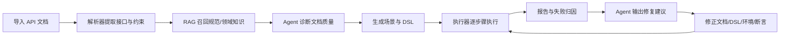

# Agent 与 RAG 闭环设计

本文说明当前平台中 Agent/RAG 如何形成闭环，以及后续实验如何证明其价值。

## 1. 角色边界

RAG 负责召回知识：

- API 文档规范。
- 资源生命周期规则。
- 鉴权传播规则。
- 常见失败模式。
- 领域 API 示例。

Agent 负责编排决策：

- 诊断文档是否可解析。
- 判断资源依赖是否闭合。
- 生成修复建议。
- 解释执行失败原因。
- 指导用户重跑和对比结果。

执行器负责给出事实反馈：

- 每个步骤的请求、响应、断言结果。
- 响应画像，如 `root_type`、字段集合、集合路径。
- 失败类别，如 `assertion_shape_mismatch`、`auth_error`、`network_error`。

## 2. 闭环流程



## 3. 当前已落地能力

- 创建任务前 Agent 能识别任务名、Base URL、环境候选、接口标识、资源风险。
- RAG benchmark 能评估知识召回效果。
- 生成侧已经引入资源生命周期、依赖链、覆盖去重、断言强度等规则。
- 执行侧已经记录响应画像和断言形态错配。
- 报告侧能够展示覆盖率、断言强度、失败类别。
- 前端详情页能够展示每步状态和断言。

## 4. 修复建议策略

执行失败后，Agent 应按以下优先级给建议：

1. 环境问题：Base URL、TLS、超时、网络不可达。
2. 鉴权问题：token、cookie、Authorization header。
3. 依赖问题：缺少 create/list/detail 保存 id。
4. 请求问题：路径参数、body 字段、content-type。
5. 断言问题：响应结构、字段路径、状态码期望。
6. 文档问题：缺少 Request/Expected/save_context/资源来源。

## 5. RAG 知识库建设

建议持续沉淀四类知识：

- `standards/`：文档规范、DSL 规范、断言规范。
- `generation_rules/`：资源生命周期、鉴权传播、断言保护规则。
- `failure_patterns/`：乱码、截断、缺资源来源、字段污染、SSL/超时。
- `domain/`：RESTful Booker、Petstore、Task Center 等领域样例。

新增知识后运行：

```powershell
python platform/requirement-analysis/scripts/run_rag_benchmark.py
```

如果 Recall@K 没有提升，说明知识文本或 query 设计需要调整。

## 6. 是否算 Agent 架构

当前系统不是纯聊天机器人，也不是简单工作流。更准确地说，它是：

基于工作流骨架的 Agent 化测试平台。

原因：

- 主链路仍由确定性工作流保证稳定性。
- Agent 负责诊断、建议、修复路径和用户交互。
- RAG 为 Agent 和解析器提供可追溯知识依据。
- 执行反馈反过来更新下一轮修复判断。

这种设计适合论文表达：既避免纯 Agent 不稳定，也比固定工作流更具自适应能力。
