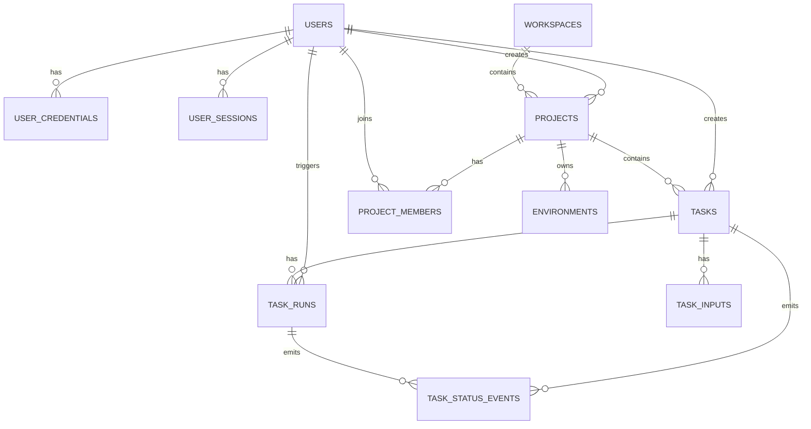

# 用户模块数据库 Schema 草案 v1

## 1. 适用范围

本文是 [user_module_database_design_v1.md](/E:/ending/LaVague-main/docs/user_module_database_design_v1.md) 的落地版补充，目标是给后续 ORM 建模、Alembic 迁移和 repository 重构提供直接参考。

本文重点输出：

- 核心表字段草案
- 表间关系
- 推荐约束与索引
- 建表顺序
- 与现有 `task-center` 的映射方式

## 2. 主键与通用字段约定

### 2.1 主键风格

建议：

- 数据库内部主键：`UUID`
- 外部展示/兼容字段：字符串业务 ID

例如：

- `users.id`：UUID
- `tasks.id`：UUID
- `tasks.task_uid`：当前外部接口仍可使用的业务任务 ID

这样做的好处：

- ORM 关联更稳定
- 不影响当前已有 `task_id` 风格
- 后续分布式或多实例扩展也更自然

### 2.2 通用字段

建议大部分业务表统一带上：

- `id`
- `created_at`
- `updated_at`
- `created_by`（视场景可选）
- `deleted_at`（如果要软删除）

第一版如果不做完整软删除，也建议至少保留：

- `status`
- `archived`

## 3. ER 关系概览

可按下面的关系理解：



## 4. 表定义草案

以下字段类型以 PostgreSQL 风格描述，SQLite 第一版可做兼容映射。

---

## 4.1 users

用途：

- 用户主信息

建议字段：

| 字段 | 类型 | 约束 | 说明 |
| --- | --- | --- | --- |
| `id` | UUID | PK | 用户主键 |
| `username` | VARCHAR(64) | UNIQUE, NOT NULL | 登录名 |
| `email` | VARCHAR(128) | UNIQUE | 邮箱 |
| `display_name` | VARCHAR(128) | NOT NULL | 展示名 |
| `avatar_url` | VARCHAR(512) | NULL | 头像 |
| `status` | VARCHAR(32) | NOT NULL | `active/disabled/pending` |
| `last_login_at` | TIMESTAMP | NULL | 最近登录时间 |
| `created_at` | TIMESTAMP | NOT NULL | 创建时间 |
| `updated_at` | TIMESTAMP | NOT NULL | 更新时间 |

建议索引：

- `ux_users_username`
- `ux_users_email`

---

## 4.2 user_credentials

用途：

- 本地账号密码凭证

建议字段：

| 字段 | 类型 | 约束 | 说明 |
| --- | --- | --- | --- |
| `id` | UUID | PK | 主键 |
| `user_id` | UUID | FK users(id), UNIQUE | 一对一 |
| `password_hash` | VARCHAR(255) | NOT NULL | 哈希值 |
| `password_algo` | VARCHAR(32) | NOT NULL | 如 `bcrypt` |
| `must_change_password` | BOOLEAN | NOT NULL DEFAULT FALSE | 首次修改 |
| `password_updated_at` | TIMESTAMP | NOT NULL | 更新时间 |
| `created_at` | TIMESTAMP | NOT NULL | 创建时间 |

说明：

- 若以后支持 OAuth，可新增 `user_auth_identities`，不要把第三方登录信息塞进本表。

---

## 4.3 user_sessions

用途：

- Refresh token / 登录会话追踪

建议字段：

| 字段 | 类型 | 约束 | 说明 |
| --- | --- | --- | --- |
| `id` | UUID | PK | 主键 |
| `user_id` | UUID | FK users(id) | 用户 |
| `refresh_token_hash` | VARCHAR(255) | NOT NULL, UNIQUE | 刷新令牌哈希 |
| `client_type` | VARCHAR(32) | NULL | `web/cli/api` |
| `user_agent` | VARCHAR(512) | NULL | 客户端信息 |
| `ip_address` | VARCHAR(64) | NULL | 登录 IP |
| `expires_at` | TIMESTAMP | NOT NULL | 过期时间 |
| `revoked_at` | TIMESTAMP | NULL | 吊销时间 |
| `created_at` | TIMESTAMP | NOT NULL | 创建时间 |

建议索引：

- `ix_user_sessions_user_id`
- `ix_user_sessions_expires_at`

---

## 4.4 workspaces

用途：

- 多团队/多租户扩展根节点

建议字段：

| 字段 | 类型 | 约束 | 说明 |
| --- | --- | --- | --- |
| `id` | UUID | PK | 主键 |
| `name` | VARCHAR(128) | NOT NULL | 名称 |
| `slug` | VARCHAR(64) | UNIQUE, NOT NULL | 稳定标识 |
| `owner_user_id` | UUID | FK users(id) | 拥有者 |
| `status` | VARCHAR(32) | NOT NULL | `active/disabled` |
| `created_at` | TIMESTAMP | NOT NULL | 创建时间 |
| `updated_at` | TIMESTAMP | NOT NULL | 更新时间 |

说明：

- 第一版可以只创建默认 workspace。

---

## 4.5 projects

用途：

- 任务和环境的业务归属空间

建议字段：

| 字段 | 类型 | 约束 | 说明 |
| --- | --- | --- | --- |
| `id` | UUID | PK | 主键 |
| `workspace_id` | UUID | FK workspaces(id) | 所属 workspace |
| `name` | VARCHAR(128) | NOT NULL | 项目名 |
| `description` | TEXT | NULL | 描述 |
| `created_by` | UUID | FK users(id) | 创建人 |
| `status` | VARCHAR(32) | NOT NULL | `active/archived` |
| `created_at` | TIMESTAMP | NOT NULL | 创建时间 |
| `updated_at` | TIMESTAMP | NOT NULL | 更新时间 |

建议索引：

- `ix_projects_workspace_id`
- `ix_projects_created_by`

---

## 4.6 project_members

用途：

- 项目级成员与角色

建议字段：

| 字段 | 类型 | 约束 | 说明 |
| --- | --- | --- | --- |
| `id` | UUID | PK | 主键 |
| `project_id` | UUID | FK projects(id) | 项目 |
| `user_id` | UUID | FK users(id) | 用户 |
| `role` | VARCHAR(32) | NOT NULL | `owner/editor/runner/viewer` |
| `joined_at` | TIMESTAMP | NOT NULL | 加入时间 |

唯一约束：

- `(project_id, user_id)`

---

## 4.7 tasks

用途：

- 任务主索引

建议字段：

| 字段 | 类型 | 约束 | 说明 |
| --- | --- | --- | --- |
| `id` | UUID | PK | 主键 |
| `task_uid` | VARCHAR(64) | UNIQUE, NOT NULL | 外部任务 ID |
| `project_id` | UUID | FK projects(id) | 所属项目 |
| `created_by` | UUID | FK users(id) | 创建人 |
| `task_name` | VARCHAR(255) | NOT NULL | 任务名 |
| `source_type` | VARCHAR(32) | NOT NULL | `text/file/url` |
| `source_path` | VARCHAR(1024) | NULL | 输入路径 |
| `target_system` | VARCHAR(512) | NULL | 目标系统 |
| `environment_name` | VARCHAR(64) | NULL | 关联环境名 |
| `status` | VARCHAR(32) | NOT NULL | 任务当前状态 |
| `artifact_dir` | VARCHAR(1024) | NULL | artifact 根目录 |
| `current_run_id` | UUID | NULL | 当前 run |
| `archived` | BOOLEAN | NOT NULL DEFAULT FALSE | 是否归档 |
| `created_at` | TIMESTAMP | NOT NULL | 创建时间 |
| `updated_at` | TIMESTAMP | NOT NULL | 更新时间 |

建议索引：

- `ux_tasks_task_uid`
- `ix_tasks_project_id_created_at`
- `ix_tasks_created_by_created_at`
- `ix_tasks_status_created_at`

---

## 4.8 task_inputs

用途：

- 任务输入快照

建议字段：

| 字段 | 类型 | 约束 | 说明 |
| --- | --- | --- | --- |
| `id` | UUID | PK | 主键 |
| `task_id` | UUID | FK tasks(id) | 所属任务 |
| `requirement_text` | TEXT | NULL | 原始输入文本 |
| `source_file_sha256` | VARCHAR(64) | NULL | 文件校验值 |
| `analysis_options_json` | JSON/TEXT | NULL | 解析参数 |
| `execution_options_json` | JSON/TEXT | NULL | 执行参数 |
| `created_at` | TIMESTAMP | NOT NULL | 创建时间 |

说明：

- 第一版可一对一
- 后续如果支持任务输入版本化，也可一对多

---

## 4.9 task_runs

用途：

- 任务执行记录

建议字段：

| 字段 | 类型 | 约束 | 说明 |
| --- | --- | --- | --- |
| `id` | UUID | PK | 主键 |
| `task_id` | UUID | FK tasks(id) | 所属任务 |
| `run_no` | INTEGER | NOT NULL | 第几次运行 |
| `triggered_by` | UUID | FK users(id) | 触发人 |
| `execution_mode` | VARCHAR(32) | NOT NULL | `api/ui/load` |
| `status` | VARCHAR(32) | NOT NULL | 运行状态 |
| `parse_mode` | VARCHAR(32) | NULL | `rules/llm` |
| `llm_used` | BOOLEAN | NOT NULL DEFAULT FALSE | 是否用了 LLM |
| `rag_enabled` | BOOLEAN | NOT NULL DEFAULT FALSE | 是否开启 RAG |
| `rag_used` | BOOLEAN | NOT NULL DEFAULT FALSE | 是否实际使用 |
| `started_at` | TIMESTAMP | NULL | 开始时间 |
| `finished_at` | TIMESTAMP | NULL | 结束时间 |
| `duration_ms` | BIGINT | NULL | 耗时 |
| `summary_json` | JSON/TEXT | NULL | 摘要信息 |
| `analysis_report_path` | VARCHAR(1024) | NULL | 报告路径 |
| `execution_result_path` | VARCHAR(1024) | NULL | 执行结果路径 |
| `created_at` | TIMESTAMP | NOT NULL | 创建时间 |

唯一约束：

- `(task_id, run_no)`

建议索引：

- `ix_task_runs_task_id_run_no`
- `ix_task_runs_triggered_by_started_at`
- `ix_task_runs_status_started_at`

---

## 4.10 task_status_events

用途：

- 状态流转审计

建议字段：

| 字段 | 类型 | 约束 | 说明 |
| --- | --- | --- | --- |
| `id` | UUID | PK | 主键 |
| `task_id` | UUID | FK tasks(id) | 任务 |
| `run_id` | UUID | FK task_runs(id) | 运行记录 |
| `from_status` | VARCHAR(32) | NULL | 原状态 |
| `to_status` | VARCHAR(32) | NOT NULL | 新状态 |
| `reason` | VARCHAR(255) | NULL | 变更原因 |
| `operator_user_id` | UUID | FK users(id) | 操作者 |
| `created_at` | TIMESTAMP | NOT NULL | 事件时间 |

---

## 4.11 environments

用途：

- 项目级环境配置

建议字段：

| 字段 | 类型 | 约束 | 说明 |
| --- | --- | --- | --- |
| `id` | UUID | PK | 主键 |
| `project_id` | UUID | FK projects(id) | 所属项目 |
| `name` | VARCHAR(64) | NOT NULL | 环境名 |
| `base_url` | VARCHAR(512) | NULL | 地址 |
| `default_headers_json` | JSON/TEXT | NULL | 默认请求头 |
| `auth_json` | JSON/TEXT | NULL | 鉴权配置 |
| `cookies_json` | JSON/TEXT | NULL | cookies |
| `description` | TEXT | NULL | 说明 |
| `created_by` | UUID | FK users(id) | 创建人 |
| `created_at` | TIMESTAMP | NOT NULL | 创建时间 |
| `updated_at` | TIMESTAMP | NOT NULL | 更新时间 |

唯一约束：

- `(project_id, name)`

---

## 4.12 audit_logs

用途：

- 审计日志

建议字段：

| 字段 | 类型 | 约束 | 说明 |
| --- | --- | --- | --- |
| `id` | UUID | PK | 主键 |
| `user_id` | UUID | FK users(id) | 操作者 |
| `action` | VARCHAR(64) | NOT NULL | 操作 |
| `resource_type` | VARCHAR(64) | NOT NULL | 资源类型 |
| `resource_id` | VARCHAR(128) | NULL | 资源标识 |
| `detail_json` | JSON/TEXT | NULL | 详情 |
| `ip_address` | VARCHAR(64) | NULL | IP |
| `created_at` | TIMESTAMP | NOT NULL | 记录时间 |

## 5. SQLAlchemy 建模建议

### 5.1 拆分模块

建议按模块放模型：

```text
platform/task-center/src/task_center/db/
  base.py
  session.py
  models/
    user.py
    project.py
    task.py
    environment.py
    audit.py
```

### 5.2 Repository 拆分

建议与当前 `registry` 拆层：

- `TaskRepositoryDB`
- `TaskRunRepositoryDB`
- `EnvironmentRepositoryDB`
- `UserRepositoryDB`
- `ProjectRepositoryDB`

这样可以保留一段时间 JSON repository 与 DB repository 并存。

## 6. 建表顺序建议

建议迁移顺序：

1. `users`
2. `user_credentials`
3. `user_sessions`
4. `workspaces`
5. `projects`
6. `project_members`
7. `environments`
8. `tasks`
9. `task_inputs`
10. `task_runs`
11. `task_status_events`
12. `audit_logs`

## 7. 与现有 API 的映射建议

### 7.1 当前创建任务

当前 `POST /api/tasks` 对应未来：

- 写 `tasks`
- 写 `task_inputs`
- 创建第一条 `task_status_events`

### 7.2 当前执行任务

当前 `POST /api/tasks/{task_id}/execute` 对应未来：

- 追加一条 `task_runs`
- 更新 `tasks.current_run_id`
- 写状态变更事件

### 7.3 当前环境管理

当前环境 JSON 存储未来对应：

- 直接改为 `environments` 表

## 8. 迁移策略建议

### 8.1 第一阶段

- 保持 `TaskRegistry` 接口不变
- 内部先加 DB repository
- JSON 仍保留为 artifact / 回退保障

### 8.2 第二阶段

- 优先让“新创建的数据”落库
- 历史 JSON 数据用懒迁移方式导入

### 8.3 第三阶段

- 以数据库为主
- JSON repository 只保留导出/兼容能力

## 9. 最小可实施版本

如果你现在就准备开工，建议第一批先实现这 6 张：

- `users`
- `user_credentials`
- `projects`
- `project_members`
- `tasks`
- `task_runs`

这已经足够支撑：

- 登录注册
- 项目归属
- 任务归属
- 任务历史记录

后续再补：

- `user_sessions`
- `environments`
- `audit_logs`
